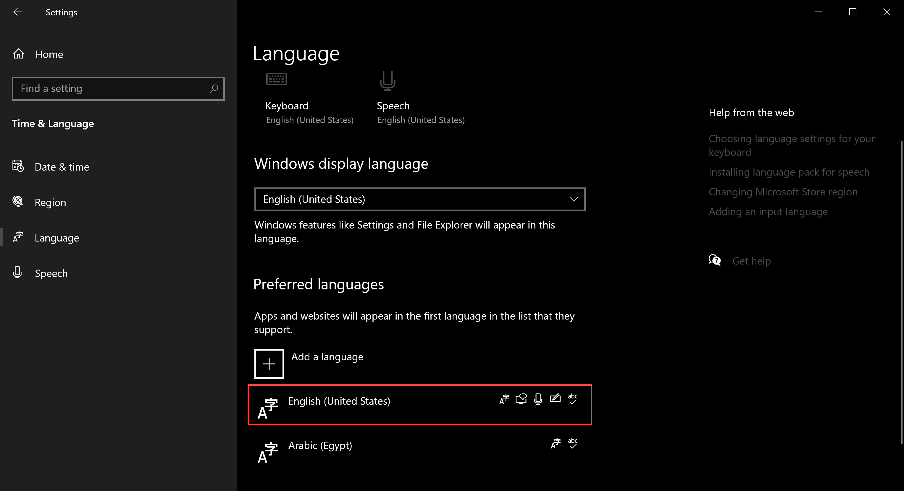
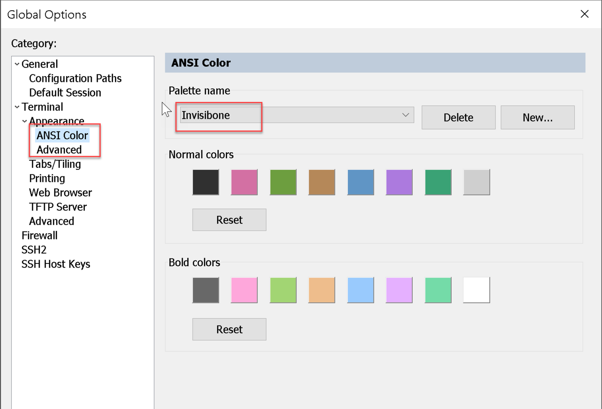

[TOC]

# Introduction

The goal of this document is to collect different application settings that you will use during taking your JNCIE-X Exam to have a pleasant and uninterrupted experience. The last thing that you want to see while taking exam is a Screen of Death :(


or, worse, A notification to restart your laptop to apply unnecessary windows updates!


in this document, You will see different optimization settings for exam applications such as Windows, SecureCRT, and Notepad++. At first glance, you will feel this is a long list to do. However, Remember, you need to do it only a single time for something like `Windows Settings`. In other settings, you need to do them a couple of times and they will be saved in your muscle memory.

# Windows Settings

Below are some settings to tweak the Microsoft `Windows 10` or Microsoft `Windows 11`

## Firewall and Security Settings

- Disable Virus and Malware protection since this service consumes high CPU


- Disable Microsoft Bitdefender

```shell
run command line as administrator then execute the following command 

REG ADD "hklm\software\policies\microsoft\windows defender" /v DisableAntiSpyware /t REG_DWORD /d 1 /f
```


- Turn any info notifications related to  Windows Security


## Search and Storage Settings

- Disable Windows Search Service


- Also, Disable the indexing services for your directories

  


- Remove Temp files


- Enable `Storage Sense` to git rid of temp files quickly


## Services Settings

- Ensure the background settings are disabled


- Turn off the `Game Mode`

  


- Also, Turn off the xbox game bar


- Disable Cortana


- Turn off the Bitlocker


- Disable the transparency and animations under visual effects


- Ensure the US keyboard is added beside your native language



> if you're unable to add the US keyboard and you keep getting the UK layout instead, then follow the instructions in this link: https://superuser.com/questions/1429636/how-to-remove-unneeded-eng-international-keyboard-layout-from-windows-10-permane


- Ensure the `US` keyboard layout is selected. Otherwise, the `#` (shift + 3) won't work as expected


## Windows Update settings

- Update to the latest update available by Microsoft and do all needed restarts

 


- Then pause the updates to the time after your exam (7 days, for example)


## Battery and Sleep Settings

- Ensure the battery power mode  is `Best Performance`

  


- Ensure your laptop never go to sleep mode (either when plugged in or connected to a power source) --> This is to avoid disconnecting from the JNCIE exam while taking a break


## Misc. Settings

- if you're connected to the internet using the ethernet cable, ensure the `Ethernet` icon is showing connected 


- Turn off windows HotKeys to avoid being triggered during the exam


- if you're connecting external display, then make sure to select it as your main display and choose `Extend these displays` option


- Also, make sure the Audio output is coming from your laptop/speakers and not from the display itself

  


# SecureCRT Settings

As you already know, SecureCRT is the official terminal for JNCIE exams. You will get a licensed version of SecureCRT 8.5 running over Windows VM (different than your windows operating system running on your laptop). Below are a few settings needed to be adjusted on the SecureCRT instance 


## Editing the Global Options

- Configure your preferred `ANSI Color` from `Edit > Global Options > Terminal > Appearance > ANSI Color`

  

​		


- Also, Do the same in `Advanced > Color schemes`

  

​	


- Make it easy to clone the current session to another tab by `double click` on the active session. Also, Avoid losing the current open sessions when accidentally clicking on the close session 

  


- Disable the `Session Zooming` using the mouse

  

## Editing the Default Sessions

You can access the default session options from `Edit > Edit Default Session`

- Disable the `Jump Scroll` under `Terminal` (This setting used to jump to the last line of the output returned from the remote host. it's distracting when you want to examine a log entries example). Also, Configure the `NO-OP`protocol to be low number (20 seconds for example) to prevent disconnecting the session due to inactivity

  


- Configure the default Terminal emulation to be `XTERM` with the support of the ANSI color that you previously configured in Global options. Also, increase the `Scrollback Buffer` to the maximum (128000), so you can examine long output without being overwritten

  


- uncheck the `80/132 column switching` under `Emulation > Modes`. This setting will keep resizing your main SecureCRT window when you enter to a tmux session which is very annoying.

  


- Check `Ignore window title change requests` under `Emulation > Advanced`. This will force SecureCRT to keep the session name as the hostname (for example `k8s-controller-1`) and not change it to the name of the current directory (i.e. `root@host:/etc/contrail`)

  


- Again, You can force using a specific look and feel on all sessions by copying the `Current color scheme` into a new name and then configuring the foreground/background color 

  


- The `jncie` theme for example, is copied from `invisibone` with slight change in background color

  

​		

- one of the important points, is to configure the `Highlight keywords` in SecureCRT default sessions to match for specific patterns using regex. I used to match IP addresses, states like `UP`, `RUNNING`, `down`, `ERROR`..etc

  


- Example of bgp summary after applying the keyword highlighting

  


# Notepad++ Editor 

The N++ is installed by default on your remote windows session. below are the most important settings in the editor. There are two locations to modify the settings. The `Preferences` and the `Style Configurator`


## Preferences

This settings is accessible from `Settings > Preferences`

- Under `General`, Enable `Multi-line`  to have multiline opened tabs. Also, Enable `Double click to close document` option to save time 

  


- Under `Language`, Ensure the default `Tab Settings` is set to `2` and the N++ will replace the tab with the white space. This is very important while editing the YAML file. You can also confirm that YAML language will inherit this settings from the default

  

  


- Under `Highlighting`, Enable `Highlight Matching Tags` and `Match case` so you can easy find all matching keywords within a file

  


- Under `Auto-Completion`, Disable it!. Yes you are not developing or writing a code in JNCIE-X exams and this feature is very annoying when you type in the editor.

  


## Style Configurator

All important options under this setting are located under `Global Styles`. You can access it by going to `Settings > Style Configurator` then applying the following 

- Change the theme to one that is easy on your eye (I feel comfortable with `Solarized-light`)

- increase the `Font size` to 11 or 12, then make this setting applied to all language by selecting `Enable global fount size`

  

